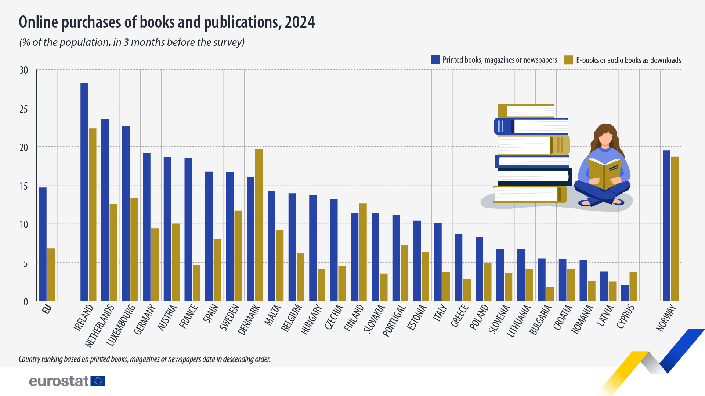
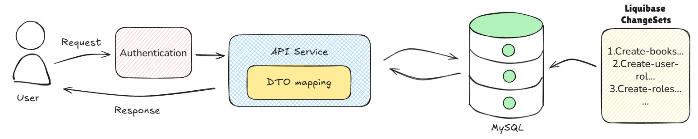
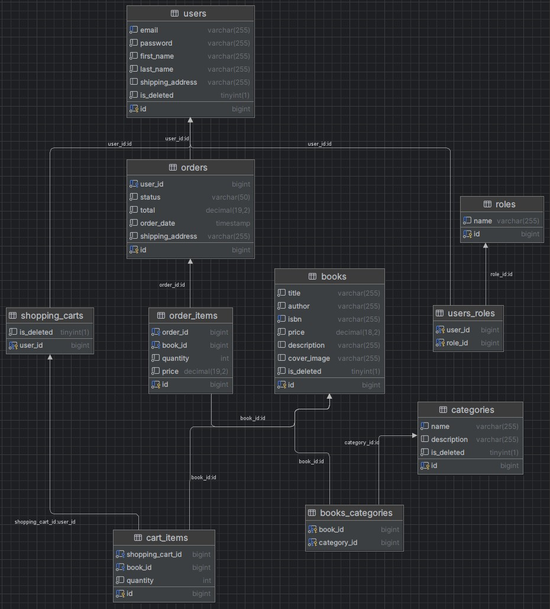
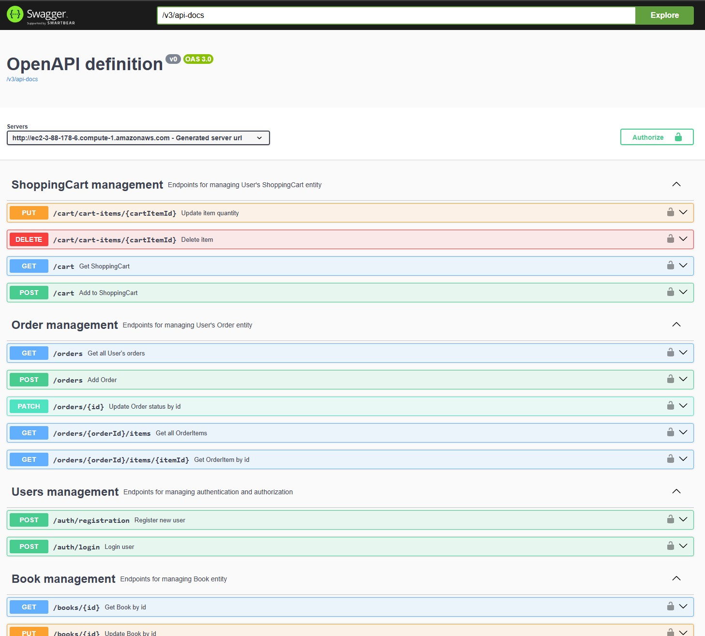

<h1 align="center">:book: **𝔹𝕠𝕠𝕜 𝕊𝕥𝕠𝕣𝕖**</h1>


[](#)
[](#)
[](#)
[](#)
[](#)
[](#)
[](#)
[](#)
[](#)
[](#)

## :page_with_curl: Sections:

* [Contacts](#telephone_receiver-contacts)
* [Shared links](#link-shared-links)
* [Introduction](#mag-introduction)
* [Technologies Stack](#floppy_disk-technologies-stack)
* [Architecture Overview](#memo-architecture-overview)
* [Endpoints](#round_pushpin-endpoints)
* [Database Schema Relationship Diagram](#dart-database-schema-relationship-diagram)
* [Postman collections](#postman-collections)
* [How to Clone and Run the Project](#-how-to-clone-and-run-the-project)

---

## :telephone_receiver: Contacts:
[](mailto:bohdandimov94@gmail.com)
[](https://github.com/SSXcorp)
[](https://www.linkedin.com/in/bohdan-dimov-043816205)

> [!NOTE]
> For business communication you can send email on bohdandimov94@gmail.com

---

## :link: Shared Links:

1. [Swagger link](http://ec2-3-88-178-6.compute-1.amazonaws.com/swagger-ui/index.html#/)
2. [GitHub project](https://github.com/SSXcorp/Book-Store-Final)
3. [Public Postman application endpoints for tests](https://www.postman.com/starlight-ssx/bookstorepublic/collection/kqn67j5/bookstoreapp?action=share&creator=17715692)

---

## :mag: Introduction:

According to Eurostat, over 20% of Europeans buy books online, and this number keeps growing. In response, this project focuses on the backend development of a Java-based website for selling books online. It is designed to ensure high performance, strong security, and scalability, enabling the system to handle growing traffic and protect user data. The platform lays a solid foundation for a reliable and efficient online book shopping experience.

The app can be scaled to sell both paper and e-books in different formats. This could solve the problem of greening and deforestation for paper production in the future.



_Eurostat statistic data_

---

## :floppy_disk: Technologies Stack:
[](#)
* Java (jbr-17.0.11 JetBrains)
* Spring Framework(Web, Security, Validation, Data-jpa) (v3.4.3)
* MySQL (v0.0.32)
* Liquibase (v4.29.2)
* Lombok (v1.18.36)
* Mapstruct (v1.6.3)
* Maven (v3.3.0)
* JWT (v0.12.5)
* Junit (v3.0.0+), Mockito
* Swagger (v2.7.0)
* Docker (v28.0.4, build b8034c0)
* AWS

---

## :memo: Architecture Overview

- This app follows a Layered Architecture pattern:
- DTO Layer: transfers data between different parts of an application, isolating the internal model from external clients.
- Controller Layer: Exposes RESTful endpoints and handles HTTP requests/responses.
- Service Layer: Contains core business logic and mediates between controllers and repositories.
- Mapping Layer: converts data between different representations, transforming domain models into DTOs (and vice versa).
- Repository Layer: Interacts with the database using Spring Data JPA.
- Model Layer: Defines domain entities to be saved in a database.
- Security Layer: Implements JWT-based authentication and role-based access control.
  </br>


_Simple backend request example model_
---

## :round_pushpin: Endpoints
The system is built on a RESTful architecture and includes the following main controllers:

**AuthenticationController**

- **POST: `/registration`** - Register new users (with role USER)
- **POST: `/login`** - Authenticate existing users with JWT

**BookController**

- **POST: `/books`** - Create a new book (only for role ADMIN)
- **GET: `/books`** - View list all available books
- **GET: `/books/{id}`** - View a book by id
- **PUT: `/books/{id}`** - Update a book by id (only for role ADMIN)
- **DELETE: `/books/{id}`** - Mark as deleted a book by id (only for role ADMIN)
- **GET: `/books/search`** - Filter books by: title, author, price, category

**OrderController**

- **POST: `/orders`** - Create a new order (only for role ADMIN)
- **GET: `/orders`** - View list all available orders
- **GET: `/orders/{id}`** - View an order by id
- **GET: `/orders/{orderId}/items/{itemId}`** - View an item by itemId in the order by orderId
- **PATCH: `/orders/{id}`** - Change status order by id (only for role ADMIN)

**CategoryController**

- **POST: `/categories`** - Create a new category (only for role ADMIN)
- **GET: `/categories`** - View list all available categories
- **GET: `/categories/{id}`** - View a category by id
- **PUT: `/categories/{id}`** - Update a category by id (only for role ADMIN)
- **DELETE: `/categories/{id}`** - Mark as deleted a category by id (only for role ADMIN)
- **GET: `/categories/{id}/books`** - View list of books by category id

**ShoppingCartController**

- **POST: `/cart`** - Add the item to shopping cart
- **GET: `/cart`** - View all items in the shopping cart
- **PUT: `/cart/items/{id}`** - Update the quantity item by id in the shopping cart
- **DELETE: `/cart/{id}`** - Delete the item by id in shopping cart

---

## :dart: Database Schema Relationship Diagram


> [!IMPORTANT]
> Liquibase managing tables are also present (databasechangelog and databasechangeloglock). You won't see them in the diagram to avoid complexity.

---

## Postman collections

Here is the public link to get all postman collections for your personal usage.
Feel free to use it:

All tests for each endpoint are sorted into folders with the basic parameters already set. </br>
[](https://www.postman.com/starlight-ssx/bookstorepublic/collection/kqn67j5/bookstoreapp?action=share&creator=17715692)

PostmanLink : [link](https://www.postman.com/starlight-ssx/bookstorepublic/collection/kqn67j5/bookstoreapp?action=share&creator=17715692)

> [!WARNING]
> Don't forget to set the authorization type to "Bearer Token" and specify the token of the logged in user.

---

**All tests for each endpoint are sorted into folders with the basic parameters already set. Don't forget to set the authorization type to "Bearer Token" and specify the token of the logged in user.

Swagger should be accessible all the time (similar like on a screenshot):


---

## 📥 How to Clone and Run the Project
Follow these steps to clone the project from GitHub and run it on your local machine:

1️⃣ Clone the Repository
Open your terminal or command prompt, and run the following commands:

```
git clone https://github.com/SSXcorp/Book-Store-Final.git
cd Book-Store-Final
```

2️⃣ Make sure you have the following installed:
```
Java JDK (version 17 or higher recommended)

Maven (for building and running the project)

MySQL
```

You can check this using cmd commands:

```
java --version
mvn --version
mysql --version
```

3️⃣ Configure the Database
Check the `src/main/resources/application.properties` file for database configuration and adjust the database credentials in application.properties.

```
spring.datasource.url=jdbc:mysql://localhost:3306/bookstore
spring.datasource.username=your_mysql_user
spring.datasource.password=your_mysql_password
```

4️⃣ Build and Run the Application
Run the following commands in the project directory:

```
mvn clean package
mvn spring-boot:run
```

---

## Recommendations while using

### Docker

> [!WARNING]
> If you are trying to create docker image for application do not forget to change your .env parameters:

.env file should look like this:
```
MYSQL_USER=appuser
MYSQL_PASSWORD=your_password
MYSQL_ROOT_PASSWORD=mysql2610
MYSQL_DATABASE=book_store

MYSQL_LOCAL_PORT=3308
MYSQL_DOCKER_PORT=3306

SPRING_LOCAL_PORT=8088
SPRING_DOCKER_PORT=8080
DEBUG_PORT=5005
```

> [!WARNING]
> In case you are not using Docker compose instead of Kubernetes don't forget to specify correct platform parameter. In my case platform: linux/amd64

---

**I appreciate your time viewing my project. In case of ideas on how to improve the project or find bugs/errors, as well as suggestions to join other projects, you can contact me by mail:
bohdandimov94@gmail.com or GitHub: [@SSXcorp](https://github.com/SSXcorp)**
</br>
